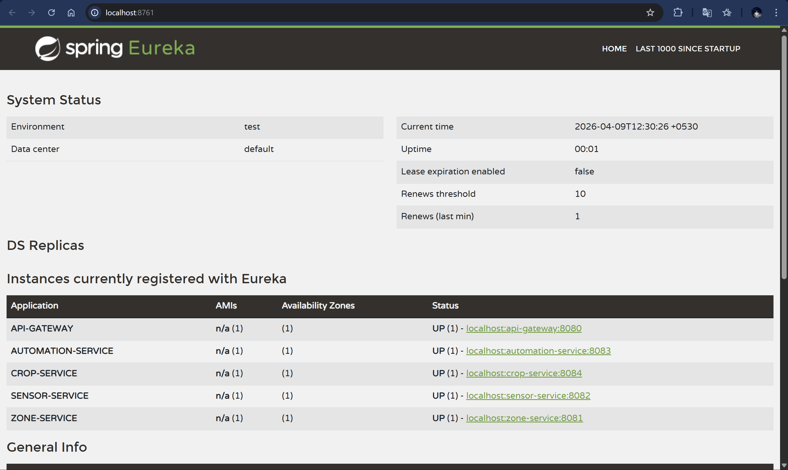

# Automated Greenhouse Management System (AGMS)

Microservice-based application for the Software Architectures & Design Patterns II assignment.

## Architecture Summary

AGMS is implemented as a distributed microservice system. `service-registry` provides service discovery, `config-server` provides centralized configuration, and `api-gateway` is the single entry point for clients. Domain services handle business features: `zone-service` manages zones and thresholds, `sensor-service` fetches telemetry and forwards data, `automation-service` applies temperature rules and stores action logs, and `crop-service` manages crop lifecycle state.

## Services

- `service-registry` (Eureka): `8761`
- `config-server`: `8888`
- `api-gateway`: `8080`
- `zone-service`: `8081`
- `sensor-service`: `8082`
- `automation-service`: `8083`
- `crop-service`: `8084`

## Project Structure

```text
Automated-Greenhouse-Management-System/
├── service-registry/      # Eureka server
├── config-server/         # Spring Cloud Config server
├── api-gateway/           # Entry point + route security
├── zone-service/          # Zone and threshold management
├── sensor-service/        # External telemetry fetch + forward
├── automation-service/    # Rule engine and action logging
├── crop-service/          # Crop lifecycle and inventory
├── AGMS.postman_collection.json
├── docs/
│   └── eureka-services-up.png
└── README.md
```

## Prerequisites

- Java 17
- Maven Wrapper (already included in each service)
- MySQL running locally
- Databases:
  - `agms_zone_db`
  - `agms_automation_db`
  - `agms_crop_db`

## Database Setup (MySQL)

Create required databases before starting services:

```sql
CREATE DATABASE agms_zone_db;
CREATE DATABASE agms_automation_db;
CREATE DATABASE agms_crop_db;
```

## Startup Order

Start services in this order from separate terminals.

1. Service Registry

```powershell
cd service-registry
./mvnw.cmd spring-boot:run
```

2. Config Server

```powershell
cd config-server
./mvnw.cmd spring-boot:run
```

3. API Gateway

```powershell
cd api-gateway
./mvnw.cmd spring-boot:run
```

4. Domain Services

```powershell
cd zone-service
./mvnw.cmd spring-boot:run
```

```powershell
cd sensor-service
./mvnw.cmd spring-boot:run
```

```powershell
cd automation-service
./mvnw.cmd spring-boot:run
```

```powershell
cd crop-service
./mvnw.cmd spring-boot:run
```

## Validation Checklist

- Open Eureka dashboard: `http://localhost:8761`
- Confirm all services are listed as `UP`
- Use API Gateway for client calls: `http://localhost:8080`

## JWT Token Setup

Gateway routes under `/api/**` require a Bearer token.

1. Login to external IoT provider and get `accessToken`:

```http
POST http://104.211.95.241:8080/api/auth/login
Content-Type: application/json

{
  "username": "your-username",
  "password": "your-password"
}
```

2. Copy the `accessToken` from the response.
3. Use it in requests as `Authorization: Bearer <accessToken>`.

## Required Submission Artifacts

- Postman collection: `AGMS.postman_collection.json` (root)
- Eureka screenshot: place in `docs/eureka-services-up.png`

## Eureka Evidence

All services registered as `UP` in Eureka:



## Postman Collection Execution

1. Import `AGMS.postman_collection.json`.
2. Set collection/environment variables:

- `gateway_base_url = http://localhost:8080`
- `jwt_token = <accessToken from login>`
- `zone_id = 1`
- `crop_id = 1`

3. Run requests in this order:

- Zone - Create
- Zone - Get by ID
- Sensor - Latest
- Automation - Logs
- Crop - Create
- Crop - Update Status
- Crop - List

4. After create requests, update `zone_id` and `crop_id` from response values.

## Troubleshooting

- If services fail to fetch config, confirm `config-server` started before domain services.
- If service-to-service calls fail, confirm Eureka is running and all services show `UP` in dashboard.
- If DB connection fails, ensure MySQL is running and required databases exist.
- If API requests return `401`, refresh/login again and update `jwt_token` in Postman.
- If sensor data is missing, verify external IoT API is reachable from your network.

## Notes

- Gateway now enforces Bearer JWT checks for `/api/**` routes.
- Domain services are configured as Spring Cloud Config clients with fallback:
  `spring.config.import=optional:configserver:http://localhost:8888`
